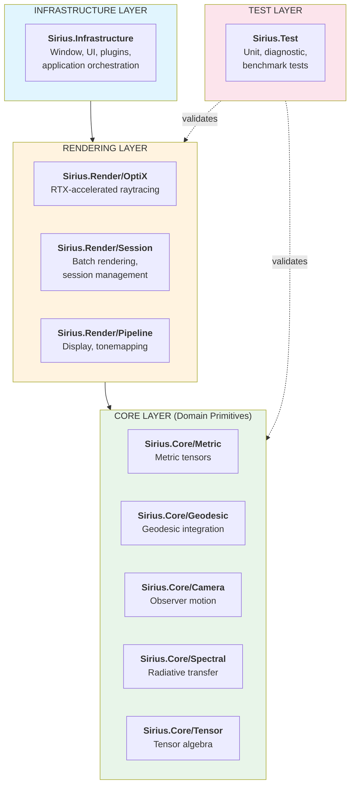
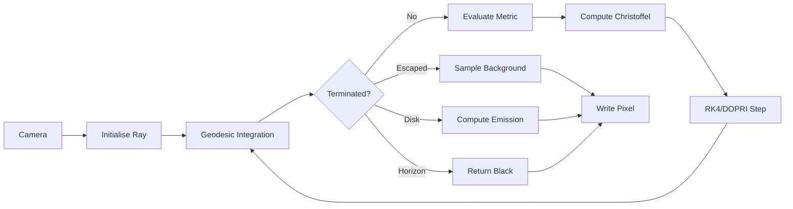
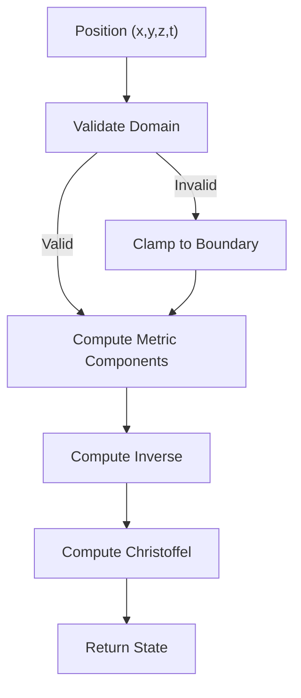

# Sirius Architecture

*Structural Design and Component Organisation*

---

## Overview

This document describes the structural organisation of Sirius, including architectural principles, layer relationships, component naming conventions, and the component registry. It provides the comprehensive reference for understanding where code lives and how it is identified.

---

## Part I: Architectural Principles

### 1.1 Separation of Concerns

Each component has a single, well-defined responsibility:

| Layer | Responsibility |
|-------|----------------|
| Physics | Metric tensors, geodesics, spacetime geometry |
| Mathematics | Tensors, dual numbers, linear algebra |
| Rendering | Ray tracing, shaders, display |
| Application | Window management, UI, orchestration |
| Testing | Validation, benchmarks, diagnostics |

### 1.2 Dependency Direction

Dependencies flow in a controlled direction:

```
Application → Rendering → Physics → Mathematics
          ↘    UI    ↗
```

Lower layers have no knowledge of higher layers. Physics does not know about rendering; mathematics does not know about physics.

### 1.3 Interface Boundaries

Components communicate through explicit interfaces. The `IMetric` interface allows the renderer to work with any spacetime geometry without coupling to specific implementations.

---

## Part II: Layer Diagram



---

## Part III: Directory Structure

```
Sirius/
├── docs/                         # Documentation
│   ├── README.md                 # Documentation index
│   ├── philosophy.md             # Design philosophy
│   ├── foundations.md            # Mathematical theory
│   ├── types.md                  # Type system
│   ├── specification.md          # Formal requirements
│   ├── guide.md                  # Practical operation
│   ├── standard.md               # Coding conventions
│   ├── architecture.md           # This document
│   └── refactor.md               # Refactoring discipline
│
├── src/                          # Source code
│   ├── Sirius.Core/              # Domain primitives
│   │   ├── Tensor/               # Multi-dimensional tensors
│   │   ├── Autodiff/             # Automatic differentiation
│   │   ├── Metric/               # Metric tensor implementations
│   │   ├── Geodesic/             # Geodesic integration
│   │   ├── Coordinate/           # Coordinate transformations
│   │   ├── Spectral/             # Radiative transfer
│   │   ├── Disk/                 # Accretion disk physics
│   │   ├── Symplectic/           # Symplectic integrators
│   │   ├── Transport/            # Parallel transport
│   │   └── Camera/               # Geodesic camera motion
│   │
│   ├── Sirius.Render/            # Rendering layer
│   │   ├── Acceleration/         # GPU backends
│   │   │   ├── OptiX/            # RTX-accelerated raytracing
│   │   │   └── Backend/          # Multi-GPU management
│   │   ├── Session/              # Render session management
│   │   │   ├── SRRS001A.h        # Render session [DEPRECATED - use SNRS001A]
│   │   │   ├── SRCT001A.h        # Cancellation token
│   │   │   ├── SRER001A.h        # Error accumulator
│   │   │   ├── SRPG001A.h        # ETA calculator
│   │   │   └── SRCK001A.h        # Checkpointing
│   │   ├── Scheduling/           # Tile scheduling
│   │   │   └── SCTM001A.h        # Tile scheduler
│   │   ├── Output/               # Output drivers
│   │   │   ├── OUMD001A.h        # Driver interface
│   │   │   ├── OUDR001A.h        # Implementations
│   │   │   ├── OUDD001A.h        # Display driver
│   │   │   ├── OUIB001A.h        # Image buffer
│   │   │   ├── OUEW001A.h/cpp    # EXR writer
│   │   │   └── OUPN001A.h/cpp    # PNG writer
│   │   ├── Camera/               # Camera models
│   │   │   ├── CMBL001A.h        # Boyer-Lindquist camera
│   │   │   └── CMFM001A.h        # Film formats
│   │   ├── Pipeline/             # Display pipeline
│   │   ├── Integration/          # Beam integration
│   │   ├── Transport/            # Spectral transport
│   │   └── Buffer/               # Frame buffers
│   │
│   ├── Sirius.Infrastructure/    # Application orchestration
│   │   ├── CRAP001A.h/cpp        # Application class
│   │   ├── CRWN001A.h/cpp        # Window management
│   │   ├── CRPM001A.h/cpp        # Plugin manager
│   │   ├── CREP001A.cpp          # Entry point (main)
│   │   └── UIMN001A.h/cpp        # UI manager
│   │
│   └── Sirius.Test/              # Test suite
│       ├── Unit/                 # Unit tests
│       ├── Diagnostic/           # Numerical stability tests
│       └── Benchmark/            # Performance benchmarks
│
├── lib/                          # External dependencies
│   ├── glad/                     # OpenGL loader
│   ├── glfw/                     # Window management
│   ├── glm/                      # Math library
│   ├── imgui/                    # UI framework
│   ├── stb/                      # Image I/O
│   └── tinyexr/                  # EXR format support
│
├── bin/                          # Build output (gitignored)
│   └── Sirius.Build/             # CMake build directory
│
├── ren/                          # Render output (gitignored)
│
├── CMakeLists.txt                # Build configuration
└── README.md                     # Project overview
```

---

## Part IV: Component Naming Convention

### 4.1 Format

```
[Domain][Category][Sequence][Variant]
```

**Example:** `PHMT001A`

- **Domain:** `PH` (Physics)
- **Category:** `MT` (Metric Tensor)
- **Sequence:** `001` (First component)
- **Variant:** `A` (Primary implementation)

### 4.2 Domain Codes

| Code | Domain | Description |
|------|--------|-------------|
| `PH` | Physics | Metrics, geodesics, spacetime geometry |
| `MT` | Math | Tensors, dual numbers, algebra |
| `RD` | Render | Raytracer, shaders, display |
| `UI` | Interface | User controls, ImGui |
| `CR` | Core | Application, windowing, plugins (Infrastructure) |
| `CM` | Camera | Camera models, film formats, ray generation |
| `SR` | Session | Render session management, checkpointing, error handling |
| `SC` | Scheduling | Tile scheduling, work distribution |
| `OU` | Output | Output drivers (PNG, EXR, display) |
| `PP` | PostProcess | Tonemapping, bloom, effects |
| `NR` | Numerics | Data loaders, converters |
| `TS` | Test | Test cases |

### 4.3 Category Codes

#### Physics (PH)

| Code | Category | Description |
|------|----------|-------------|
| `MT` | Metric | Metric tensor implementations |
| `GD` | Geodesic | Geodesic integration |
| `CF` | Christoffel | Connection coefficients |
| `CT` | Coordinate | Coordinate transformations |
| `OB` | Observer | Observer physics, tetrads |
| `RS` | Redshift | Frequency shift calculations |

#### Mathematics (MT)

| Code | Category | Description |
|------|----------|-------------|
| `DL` | Dual | Dual numbers, autodiff |
| `TN` | Tensor | Tensor algebra |
| `VT` | Vector | Vector types |
| `QT` | Quaternion | Rotation mathematics |

#### Rendering (RD)

| Code | Category | Description |
|------|----------|-------------|
| `RT` | Raytracer | Core raytracing logic |
| `OP` | OptiX | OptiX host/device code |
| `TX` | Texture | Texture handling |
| `DP` | Display | OpenGL display/window |

#### Test Suite (TS)

| Code | Category | Description |
|------|----------|-------------|
| `UN` | Unit | Component-level unit tests |
| `IN` | Integration | End-to-end integration tests |
| `DG` | Diagnostic | Numerical stability tests |
| `BM` | Benchmark | Performance benchmarks |

### 4.4 Variant Codes

| Code | Meaning | Usage |
|------|---------|-------|
| `A` | Primary | Production-ready implementation |
| `B` | Alternative | Alternative algorithm |
| `X` | Experimental | Under development |
| `D` | Deprecated | Superseded, kept for reference |

---

## Part V: Component Registry

### 5.1 Sirius.Math

| Code | File | Description |
|------|------|-------------|
| `MTDL001A` | `MTDL001A.h` | Dual number arithmetic |
| `MTTN001A` | `MTTN001A.h/cpp` | Multi-dimensional tensor |

### 5.2 Sirius.Physics

| Code | File | Description |
|------|------|-------------|
| `PHMT000A` | `PHMT000A.h` | Metric tensor interface |
| `PHMT001A` | `PHMT001A.h/cpp` | Minkowski metric |
| `PHMT002A` | `PHMT002A.h/cpp` | Schwarzschild metric |
| `PHMT003A` | `PHMT003A.h/cpp` | Kerr metric |
| `PHMT004A` | `PHMT004A.h/cpp` | Reissner-Nordström metric |
| `PHMT100A` | `PHMT100A.h` | Kerr-Schild family (unified) |
| `PHMT101A` | `PHMT101A.h` | Morris-Thorne family |
| `PHMT102A` | `PHMT102A.h` | Warp drive family |
| `PHGD001A` | `PHGD001A.h/cpp` | Geodesic integrator |
| `PHGD002A` | `PHGD002A.h/cpp` | Numerical geodesic integrator |
| `PHCT001A` | `PHCT001A.h` | Coordinate transformations |

### 5.3 Sirius.Render

#### Core Rendering

| Code | File | Description |
|------|------|-------------|
| `RDRT001A` | `Pipeline/RDRT001A.cpp` | Main renderer |
| `RDOP001A` | `Acceleration/OptiX/RDOP001A.cu` | OptiX host code |
| `RDOP002A` | `Acceleration/OptiX/RDOP002A.cu` | OptiX device kernels |
| `RDOP003A` | `Acceleration/OptiX/RDOP003A.h` | Launch parameters |

#### Session Management (Sirius.Render/Session)

| Code | File | Description |
|------|------|-------------|
| `SRRS001A` | `Session/SRRS001A.h` | Render session manager [DEPRECATED - use Sirius::RenderSession (SNRS001A)] |
| `SRCT001A` | `Session/SRCT001A.h` | Cancellation token |
| `SRER001A` | `Session/SRER001A.h` | Error accumulator |
| `SRPG001A` | `Session/SRPG001A.h` | ETA calculator |
| `SRCK001A` | `Session/SRCK001A.h` | Checkpointing system |
| `SRIO001A` | `Session/SRIO001A.h` | Session I/O utilities |

#### Scheduling (Sirius.Render/Scheduling)

| Code | File | Description |
|------|------|-------------|
| `SCTM001A` | `Scheduling/SCTM001A.h` | Tile scheduler (spiral, Hilbert, scanline) |

#### Output Drivers (Sirius.Render/Output)

| Code | File | Description |
|------|------|-------------|
| `OUMD001A` | `Output/OUMD001A.h` | Output driver interface |
| `OUDR001A` | `Output/OUDR001A.h` | Output driver implementations (Null, Memory, EXR) |
| `OUDD001A` | `Output/OUDD001A.h` | Display driver interface and implementations |
| `OUIB001A` | `Output/OUIB001A.h` | Image buffer (HDR float) |
| `OUEW001A` | `Output/OUEW001A.h/cpp` | EXR writer (tinyexr integration) |
| `OUPN001A` | `Output/OUPN001A.h/cpp` | PNG writer (stb_image_write integration) |

#### Camera (Sirius.Render/Camera)

| Code | File | Description |
|------|------|-------------|
| `CMBL001A` | `Camera/CMBL001A.h` | Camera model (Boyer-Lindquist) |
| `CMFM001A` | `Camera/CMFM001A.h` | Film formats (IMAX 70mm, VistaVision, etc.) |

### 5.4 Sirius.Core

| Code | File | Description |
|------|------|-------------|
| `CREP001A` | `CREP001A.cpp` | Entry point (main) |
| `CRAP001A` | `CRAP001A.h/cpp` | Application class |
| `CRPM001A` | `CRPM001A.h/cpp` | Plugin manager |
| `CRWN001A` | `CRWN001A.h/cpp` | Window management |

### 5.5 Sirius.Test

#### Unit Tests

| Code | File | Description |
|------|------|-------------|
| `TSMT001A` | `Unit/TSMT001A.cpp` | Dual number tests |
| `TSMT002A` | `Unit/TSMT002A.cpp` | Tensor operation tests |
| `TSPH001A` | `Unit/TSPH001A.cpp` | Schwarzschild metric tests |
| `TSPH002A` | `Unit/TSPH002A.cpp` | Christoffel symbol tests |
| `TSPH003A` | `Unit/TSPH003A.cpp` | Geodesic equation tests |

#### Offline Rendering Tests

| Code | File | Description |
|------|------|-------------|
| `TSOF001A` | `Unit/TSOF001A.cpp` | Render session tests |
| `TSOF002A` | `Unit/TSOF002A.cpp` | Cancellation token tests |
| `TSOF003A` | `Unit/TSOF003A.cpp` | Error accumulator tests |
| `TSOF004A` | `Unit/TSOF004A.cpp` | Tile scheduler tests |
| `TSOF005A` | `Unit/TSOF005A.cpp` | ETA calculator tests |
| `TSOF006A` | `Unit/TSOF006A.cpp` | Output driver tests |
| `TSOF007A` | `Unit/TSOF007A.cpp` | Checkpoint tests |
| `TSOF008A` | `Unit/TSOF008A.cpp` | Display driver tests |
| `TSOF009A` | `Unit/TSOF009A.cpp` | PNG output driver tests |

#### Diagnostic Tests

| Code | File | Description |
|------|------|-------------|
| `TSDG001A` | `Diagnostic/TSDG001A.cpp` | Edge cases and precision |
| `TSDG002A` | `Diagnostic/TSDG002A.cpp` | NaN/Inf detection |
| `TSDG003A` | `Diagnostic/TSDG003A.cpp` | Conservation law verification |
| `TSDG004A` | `Diagnostic/TSDG004A.cpp` | Determinism verification |

#### Integration Tests

| Code | File | Description |
|------|------|-------------|
| `TSIN001A` | `Integration/TSIN001A.cpp` | Geodesic path validation |
| `TSIN002A` | `Integration/TSIN002A.cpp` | Metric loader chain |
| `TSIN003A` | `Integration/TSIN003A.cpp` | Render pipeline integration |
| `TSIN004A` | `Integration/TSIN004A.cpp` | Offline renderer integration |

#### Benchmark Tests

| Code | File | Description |
|------|------|-------------|
| `TSBM001A` | `Benchmark/TSBM001A.cpp` | Integration accuracy (Killing vectors) |
| `TSBM002A` | `Benchmark/TSBM002A.cpp` | FPS performance tracking |
| `TSBM003A` | `Benchmark/TSBM003A.cpp` | Christoffel computation comparison |

---

## Part VI: Data Flow

### 6.1 Ray Tracing Pipeline



### 6.2 Metric Evaluation Flow



---

## Part VII: File Naming

### Source Files

- Headers: `ComponentCode.h`
- Implementation: `ComponentCode.cpp`
- CUDA: `ComponentCode.cu`

### Shaders

- Compute: `*.comp`
- GLSL includes: `*.glsl`
- Vertex: `*.vert`
- Fragment: `*.frag`

---

## Appendix A: Compliance

All changes to the codebase MUST adhere to this standard. Non-compliant components will be flagged during code review. New components MUST be registered in the component registry before merging.

---

*End of Architecture*
