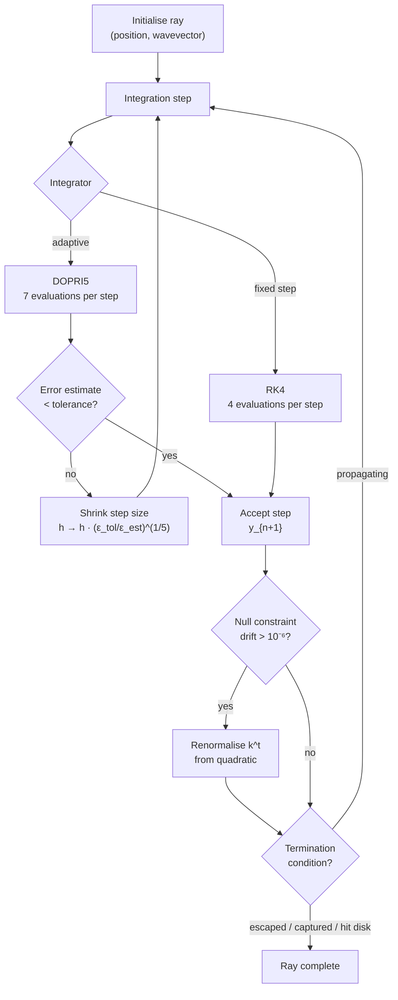
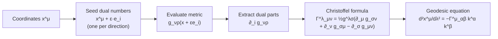

# Mathematical Foundations

## Overview

This document develops the mathematical theory underlying Sirius, from the differential geometry that describes curved spacetime through the geodesic equation that governs photon trajectories, to the specific spacetimes and numerical methods the renderer implements. Each section builds on the previous; a reader who works through the material sequentially will have a complete picture of the computational machinery.

Prerequisites: multivariate calculus, linear algebra, and basic differential equations. Prior exposure to general relativity is helpful but not essential; the relevant concepts are developed here.

---

## Part I: Differential Geometry

The language of general relativity is differential geometry. Before we can write down the equations that govern light propagation, we need the mathematical objects (manifolds, metrics, connections) that make those equations precise.

### 1.1 Manifolds and Coordinates

A **manifold** is a space that locally resembles Euclidean space. Spacetime is a four-dimensional manifold: near any point, we can assign four coordinates $(x^0, x^1, x^2, x^3)$ that smoothly parameterise the neighbourhood.

Coordinates are labels, not physical quantities. The choice of coordinates is arbitrary; physics must be independent of this choice. General relativity achieves coordinate independence through tensorial formulations: objects whose transformation rules ensure that physical laws take the same form in every coordinate system.

### 1.2 The Metric Tensor

The **metric tensor** $g_{\mu\nu}$ defines the geometry of spacetime. It is a symmetric $(0,2)$ tensor field that determines the spacetime interval between nearby events:

$$
ds^2 = g_{\mu\nu} \, dx^\mu dx^\nu
$$

where summation over repeated indices is implied (the **Einstein summation convention**).

The **Lorentzian signature** $(-, +, +, +)$ distinguishes three types of interval:

- **Timelike** ($ds^2 < 0$): separations that massive particles can traverse.
- **Spacelike** ($ds^2 > 0$): separations outside any particle's light cone.
- **Null** ($ds^2 = 0$): separations traversed by light.

Sirius traces null geodesics. The null condition is the defining constraint of the entire integration pipeline.

### 1.3 Covariant Derivative

The **covariant derivative** $\nabla_\mu$ generalises partial differentiation to curved spaces. For a vector field $V^\nu$:

$$
\nabla_\mu V^\nu = \partial_\mu V^\nu + \Gamma^\nu_{\mu\lambda} V^\lambda
$$

The **Christoffel symbols** $\Gamma^\nu_{\mu\lambda}$ encode how the coordinate basis vectors change across the manifold. They are not tensors (they do not transform as tensors under coordinate changes), but they enter the covariant derivative in a way that ensures covariant derivatives of tensors are themselves tensors.

### 1.4 Christoffel Symbols

The **Christoffel symbols** (also called connection coefficients) are defined by:

$$
\Gamma^\lambda_{\mu\nu} = \frac{1}{2} g^{\lambda\sigma} \left( \partial_\mu g_{\sigma\nu} + \partial_\nu g_{\sigma\mu} - \partial_\sigma g_{\mu\nu} \right)
$$

This definition ensures two properties:

- **Metric compatibility**: $\nabla_\lambda g_{\mu\nu} = 0$. The covariant derivative of the metric vanishes; lengths and angles are preserved under parallel transport.
- **Torsion-freeness**: $\Gamma^\lambda_{\mu\nu} = \Gamma^\lambda_{\nu\mu}$. The connection is symmetric in its lower indices.

For a 4-dimensional spacetime, the lower-index symmetry reduces the 64 components to 40 independent Christoffel symbols. Sirius computes these analytically via dual number automatic differentiation (see Part VII).

---

## Part II: The Geodesic Equation

The geodesic equation is the equation of motion for Sirius. Every photon the renderer traces obeys it; the entire integration pipeline exists to solve it numerically.

### 2.1 Geodesics as Extremal Paths

A **geodesic** is a curve that extremises proper length (for timelike curves) or satisfies the parallel transport condition (for null curves). Physically, geodesics represent the paths of freely falling particles: objects subject to no force other than gravity, which in general relativity is a manifestation of spacetime curvature rather than a force in the Newtonian sense.

The geodesic equation in affine parameterisation is:

$$
\frac{d^2 x^\mu}{d\lambda^2} + \Gamma^\mu_{\alpha\beta} \frac{dx^\alpha}{d\lambda} \frac{dx^\beta}{d\lambda} = 0
$$

where $\lambda$ is an **affine parameter** along the curve, a parameterisation that preserves the linear relationship between the tangent vector and proper time (or affine distance, for null curves).

### 2.2 Null Geodesics

For light rays, the tangent vector $k^\mu = dx^\mu/d\lambda$ satisfies the **null condition**:

$$
g_{\mu\nu} k^\mu k^\nu = 0
$$

This condition is preserved exactly by the geodesic equation in the continuous case. Numerically, integration errors cause it to drift, and explicit renormalisation is required (see §5.3).

### 2.3 First-Order Formulation

For numerical integration, we reformulate the second-order geodesic equation as a system of eight first-order equations. Define the state vector:

$$
\mathbf{y} = (x^0, x^1, x^2, x^3, k^0, k^1, k^2, k^3)
$$

The equations of motion become:

$$
\frac{dx^\mu}{d\lambda} = k^\mu
$$

$$
\frac{dk^\mu}{d\lambda} = -\Gamma^\mu_{\alpha\beta} k^\alpha k^\beta
$$

This is the system that the RK4 and DOPRI integrators solve at each step.

### 2.4 Conservation Laws

Spacetimes with symmetries possess conserved quantities along geodesics, a consequence of Noether's theorem. These conserved quantities serve double duty in Sirius: they constrain the physics and they monitor the numerics.

A **Killing vector** $\xi^\mu$ satisfies $\nabla_{(\mu} \xi_{\nu)} = 0$ (the symmetrised covariant derivative vanishes). If $\xi^\mu$ is a Killing vector, then $g_{\mu\nu} \xi^\mu k^\nu$ is constant along any geodesic.

For **stationary spacetimes** (time-translation invariance), $\partial_t$ is a Killing vector, giving conserved **energy**:

$$
E = -g_{t\mu} k^\mu
$$

For **axisymmetric spacetimes** (rotational invariance), $\partial_\phi$ is a Killing vector, giving conserved **angular momentum**:

$$
L = g_{\phi\mu} k^\mu
$$

Sirius monitors these quantities during integration. Drift beyond tolerance ($< 10^{-4}$ relative) indicates integrator error and triggers ray termination.

---

## Part III: Black Hole Spacetimes

These are the primary spacetimes Sirius renders. Each is an exact solution to Einstein's field equations, parameterised by physical quantities (mass, spin, charge) that control the geometry.

### 3.1 Schwarzschild Metric

The simplest black hole: static, spherically symmetric, uncharged, non-rotating. Described by a single parameter, the mass $M$ (in geometric units where $G = c = 1$):

$$
ds^2 = -\left(1 - \frac{2M}{r}\right)dt^2 + \left(1 - \frac{2M}{r}\right)^{-1}dr^2 + r^2 d\Omega^2
$$

where $d\Omega^2 = d\theta^2 + \sin^2\theta \, d\phi^2$ is the metric on the unit 2-sphere.

| Feature | Value | Significance |
|---------|-------|--------------|
| Event horizon | $r = 2M$ | Boundary beyond which nothing escapes |
| Photon sphere | $r = 3M$ | Unstable circular photon orbits |
| ISCO | $r = 6M$ | Innermost stable circular orbit (inner edge of a thin accretion disk) |

**Domain**: The exterior solution requires $r > 2M$. Sirius clamps at $r > 2M \cdot 1.001$ to avoid the coordinate singularity at the horizon.

### 3.2 Kerr Metric

A rotating black hole, parameterised by mass $M$ and spin parameter $a = J/M$ (angular momentum per unit mass):

$$
ds^2 = -\left(1 - \frac{2Mr}{\Sigma}\right)dt^2 - \frac{4Mar\sin^2\theta}{\Sigma}dt\,d\phi + \frac{\Sigma}{\Delta}dr^2 + \Sigma \, d\theta^2 + \left(r^2 + a^2 + \frac{2Ma^2r\sin^2\theta}{\Sigma}\right)\sin^2\theta \, d\phi^2
$$

where:

- $\Sigma = r^2 + a^2\cos^2\theta$
- $\Delta = r^2 - 2Mr + a^2$
- The **cross-term** $dt\,d\phi$ encodes **frame dragging**: spacetime itself is dragged into rotation by the black hole's spin.

| Feature | Value | Constraint |
|---------|-------|------------|
| Outer horizon | $r_+ = M + \sqrt{M^2 - a^2}$ | Requires $\|a\| \leq M$ |
| Inner horizon | $r_- = M - \sqrt{M^2 - a^2}$ | |
| Ergosphere | $r = M + \sqrt{M^2 - a^2\cos^2\theta}$ | Region where static observers cannot exist |
| Ring singularity | $r = 0$, $\theta = \pi/2$ | Physical singularity |

**Domain**: Exterior solution requires $r > r_+$ and $|a| < M$ (sub-extremal). Sirius enforces $a/M \leq 0.998$ to avoid numerical difficulties near extremality.

### 3.3 Reissner-Nordstrom Metric

A static, spherically symmetric, electrically charged black hole, parameterised by mass $M$ and charge $Q$:

$$
ds^2 = -\left(1 - \frac{2M}{r} + \frac{Q^2}{r^2}\right)dt^2 + \left(1 - \frac{2M}{r} + \frac{Q^2}{r^2}\right)^{-1}dr^2 + r^2 d\Omega^2
$$

The horizons are at $r_\pm = M \pm \sqrt{M^2 - Q^2}$. A charged black hole exists only for $|Q| \leq M$.

Astrophysical black holes are expected to be nearly neutral (infalling matter carries both charges and neutralises quickly), but the Reissner-Nordstrom solution is valuable for testing: it provides a one-parameter family interpolating between Schwarzschild ($Q = 0$) and the extremal limit ($Q = M$), exercising the renderer across a range of horizon structures.

### 3.4 Kerr-Schild Form

The metrics above are written in Boyer-Lindquist coordinates, which have coordinate singularities at the poles ($\theta = 0, \pi$) and at the horizons. The **Kerr-Schild form** avoids these problems:

$$
g_{\mu\nu} = \eta_{\mu\nu} + H \, l_\mu l_\nu
$$

where $\eta_{\mu\nu}$ is the flat Minkowski metric, $H$ is a scalar function encoding gravitational field strength, and $l_\mu$ is a null vector field.

In Cartesian Kerr-Schild coordinates, the Christoffel symbols become polynomial expressions with no divisions by $\sin\theta$ and no coordinate singularities at the poles. This is why Sirius uses Kerr-Schild coordinates for its production metric implementations: the coordinate system is chosen for numerical reliability, not mathematical elegance.

---

## Part IV: Exotic Geometries

Beyond black holes, Sirius implements spacetimes that are physically speculative but geometrically well-defined. These serve as stress tests for the renderer (unusual topologies, different causal structures) and produce visually distinctive renders.

### 4.1 Ellis Drainhole (Wormhole)

The Ellis drainhole is a traversable wormhole, a tunnel connecting two asymptotically flat regions of spacetime:

$$
ds^2 = -dt^2 + d\ell^2 + (b_0^2 + \ell^2)(d\theta^2 + \sin^2\theta \, d\phi^2)
$$

where $\ell \in (-\infty, +\infty)$ is the proper radial coordinate and $b_0$ is the **throat radius** (the minimum circumference of the tunnel).

| Feature | Value |
|---------|-------|
| Throat | $\ell = 0$, radius $b_0$ |
| Topology | Two asymptotically flat regions connected |
| Horizon | None (traversable) |

The absence of a horizon means rays can pass through the throat and emerge on the other side, producing double images of background objects.

### 4.2 Morris-Thorne Family

The general Morris-Thorne wormhole metric parameterises a broader class of traversable wormholes:

$$
ds^2 = -e^{2\Phi(r)}dt^2 + \frac{dr^2}{1 - b(r)/r} + r^2 d\Omega^2
$$

where $\Phi(r)$ is the **redshift function** (controlling gravitational time dilation) and $b(r)$ is the **shape function** (controlling the spatial geometry). The throat is at the minimum of $r$ where $b(r_0) = r_0$.

### 4.3 Alcubierre Warp Drive

The Alcubierre metric describes a region of flat spacetime (the "bubble") moving through the surrounding spacetime at arbitrary speed:

$$
ds^2 = -dt^2 + (dx - v_s f(r_s) dt)^2 + dy^2 + dz^2
$$

where $v_s$ is the velocity of the bubble, $r_s$ is the distance from the bubble centre, and $f(r_s)$ is a shaping function that equals 1 inside the bubble and 0 outside.

The metric requires exotic matter (negative energy density) to sustain, so it is not a prediction of a physically realisable drive. It is, however, a valid solution to the geodesic equation, and it produces striking visual effects: spatial compression ahead of the bubble and expansion behind.

---

## Part V: Numerical Integration

The geodesic equation is solved numerically. This section covers the integration methods Sirius uses and the strategies for controlling numerical error.

### 5.1 Fourth-Order Runge-Kutta (RK4)

The classical RK4 method for the system $\dot{\mathbf{y}} = \mathbf{f}(\mathbf{y})$:

$$
\mathbf{k}_1 = h \, \mathbf{f}(\mathbf{y}_n)
$$

$$
\mathbf{k}_2 = h \, \mathbf{f}(\mathbf{y}_n + \tfrac{1}{2}\mathbf{k}_1)
$$

$$
\mathbf{k}_3 = h \, \mathbf{f}(\mathbf{y}_n + \tfrac{1}{2}\mathbf{k}_2)
$$

$$
\mathbf{k}_4 = h \, \mathbf{f}(\mathbf{y}_n + \mathbf{k}_3)
$$

$$
\mathbf{y}_{n+1} = \mathbf{y}_n + \tfrac{1}{6}(\mathbf{k}_1 + 2\mathbf{k}_2 + 2\mathbf{k}_3 + \mathbf{k}_4)
$$

Local truncation error is $O(h^5)$; global error is $O(h^4)$. RK4 is used as the fixed-step integrator: simple, well-understood, and adequate when the step size is chosen conservatively.

### 5.2 Adaptive Stepping (DOPRI)

The Dormand-Prince method (DOPRI5) computes both fourth-order and fifth-order approximations at each step. The difference provides an error estimate without additional function evaluations (the method is "embedded"). The step size is adjusted to maintain a target error tolerance:

$$
h_{new} = h_{old} \cdot \left(\frac{\epsilon_{tol}}{|\epsilon_{est}|}\right)^{1/5}
$$

with safety factors to prevent step-size oscillation.

Adaptive stepping is more expensive per step (seven function evaluations versus four for RK4) but takes fewer steps overall, because it uses large steps in regions of low curvature and small steps near the black hole where the geometry changes rapidly. For most configurations, DOPRI is faster and more accurate than fixed-step RK4.

### 5.3 Null Constraint Preservation

Numerical errors cause the null condition $g_{\mu\nu} k^\mu k^\nu = 0$ to drift. Sirius corrects this by periodically renormalising the wavevector.

Given the spatial components $k^i$ (which carry the ray's direction), solve the quadratic

$$
g_{tt}(k^t)^2 + 2g_{ti}k^t k^i + g_{ij}k^i k^j = 0
$$

for $k^t$ and choose the future-directed root. This resets the null condition to zero without altering the ray's spatial direction.

---

## Part VI: Radiative Transfer

Tracing a ray tells you where a photon came from. Radiative transfer tells you what it carried: the intensity and spectrum of the light. This is what turns a geometric disk intersection into a visible, shaded accretion disk in the render.

### 6.1 Specific Intensity

The **specific intensity** $I_\nu$ measures energy per unit time, area, solid angle, and frequency. Along a geodesic with affine parameter $\lambda$:

$$
\frac{dI_\nu}{d\lambda} = j_\nu - \alpha_\nu I_\nu
$$

where $j_\nu$ is the **emission coefficient** (energy added per unit volume) and $\alpha_\nu$ is the **absorption coefficient** (fraction of intensity removed per unit length).

### 6.2 Relativistic Beaming

A source moving relative to the observer experiences **relativistic beaming**: the observed intensity is boosted or dimmed depending on whether the source is approaching or receding. The transformation is:

$$
I_{obs} = \delta^4 I_{emit}
$$

where $\delta$ is the **Doppler factor**, determined by the relative motion between source and observer. The fourth power arises from the transformation of solid angle, frequency, and time. For an accretion disk orbiting a black hole, this produces a characteristic asymmetry: the approaching side is dramatically brighter than the receding side.

### 6.3 Accretion Disk Models

For geometrically thin accretion disks, the **Novikov-Thorne** temperature profile gives:

$$
T(r) \propto \left[\frac{M}{\dot{M}} \frac{1}{r^3} \mathcal{C}(r)\right]^{1/4}
$$

where $\dot{M}$ is the accretion rate and $\mathcal{C}(r)$ encodes the relativistic corrections (frame dragging, binding energy, angular momentum transport) that depend on the specific metric. The inner edge of the disk is typically placed at the ISCO.

---

## Part VII: Automatic Differentiation

Computing Christoffel symbols requires the partial derivatives of the metric tensor with respect to each coordinate. Sirius obtains these derivatives exactly using dual number arithmetic, avoiding the truncation error inherent in finite differences. This section explains the mechanism.

### 7.1 Dual Numbers

A **dual number** has the form $a + b\varepsilon$ where $\varepsilon$ is a formal quantity satisfying $\varepsilon^2 = 0$ (it is nilpotent, not zero). Arithmetic on dual numbers follows from this rule:

| Operation | Result |
|-----------|--------|
| $(a + b\varepsilon) + (c + d\varepsilon)$ | $(a+c) + (b+d)\varepsilon$ |
| $(a + b\varepsilon) \cdot (c + d\varepsilon)$ | $ac + (ad + bc)\varepsilon$ |
| $\sin(a + b\varepsilon)$ | $\sin a + b\cos a \cdot \varepsilon$ |
| $\sqrt{a + b\varepsilon}$ | $\sqrt{a} + \frac{b}{2\sqrt{a}}\varepsilon$ |

The real part carries the function value; the dual part carries the derivative.

### 7.2 Forward-Mode AD

Evaluating a function $f: \mathbb{R}^n \to \mathbb{R}$ at a point $\mathbf{x}$ with a dual number perturbation in the $i$-th direction:

$$
f(\mathbf{x} + \mathbf{e}_i \varepsilon) = f(\mathbf{x}) + \frac{\partial f}{\partial x_i}\varepsilon
$$

This is **forward-mode automatic differentiation**. It provides exact derivatives (to machine precision) with no finite-difference step size to tune and no truncation error. The cost is roughly double that of a single function evaluation (one for each component of the dual number).

### 7.3 Application to Metrics

Sirius evaluates the metric tensor with dual number coordinates to obtain the derivatives $\partial_\mu g_{\nu\rho}$ needed for the Christoffel formula. Concretely: the metric function is templated on its scalar type, so the same code that computes $g_{\mu\nu}(x)$ with `double` inputs also computes $g_{\mu\nu}(x + \varepsilon)$ with `Dual<double>` inputs. The Christoffel symbols fall out of the standard formula applied to the dual-valued metric.

This is why every metric implementation in Sirius is written as a template or uses overloaded arithmetic: the dual-number machinery requires it.

---

## Appendix A: Notation Reference

| Symbol | Meaning |
|--------|---------|
| $g_{\mu\nu}$ | Metric tensor (covariant components) |
| $g^{\mu\nu}$ | Inverse metric tensor (contravariant components) |
| $\Gamma^\lambda_{\mu\nu}$ | Christoffel symbols (connection coefficients) |
| $x^\mu$ | Spacetime coordinates $(x^0, x^1, x^2, x^3)$ |
| $k^\mu$ | Photon wavevector (tangent to the null geodesic) |
| $\lambda$ | Affine parameter along a geodesic |
| $M$ | Black hole mass (in geometric units, $G = c = 1$) |
| $a$ | Spin parameter ($a = J/M$, angular momentum per unit mass) |
| $Q$ | Electric charge (in geometric units) |

## Appendix B: Unit Conventions

Sirius uses **geometric units** where $G = c = 1$. All quantities are measured in units of length:

| Quantity | Dimension | SI Conversion |
|----------|-----------|---------------|
| Mass | Length | $M_{geom} = GM_{SI}/c^2$ |
| Time | Length | $t_{geom} = ct_{SI}$ |
| Angular momentum | Length$^2$ | $J_{geom} = GJ_{SI}/c^3$ |

For a solar-mass black hole, $M \approx 1.48$ km in geometric units.

---

## References

- Misner, C. W., Thorne, K. S., & Wheeler, J. A. (1973). *Gravitation*. W. H. Freeman.
- Wald, R. M. (1984). *General Relativity*. University of Chicago Press.
- Bardeen, J. M. (1973). "Timelike and null geodesics in the Kerr metric." In *Black Holes*.
- Chandrasekhar, S. (1983). *The Mathematical Theory of Black Holes*. Oxford University Press.
- Hairer, E., Norsett, S. P., & Wanner, G. (1993). *Solving Ordinary Differential Equations I*. Springer.
- Press, W. H. et al. (2007). *Numerical Recipes*. Cambridge University Press.
