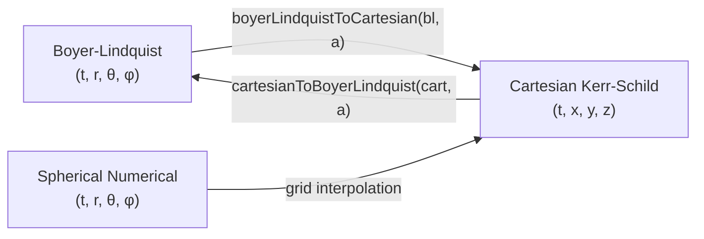
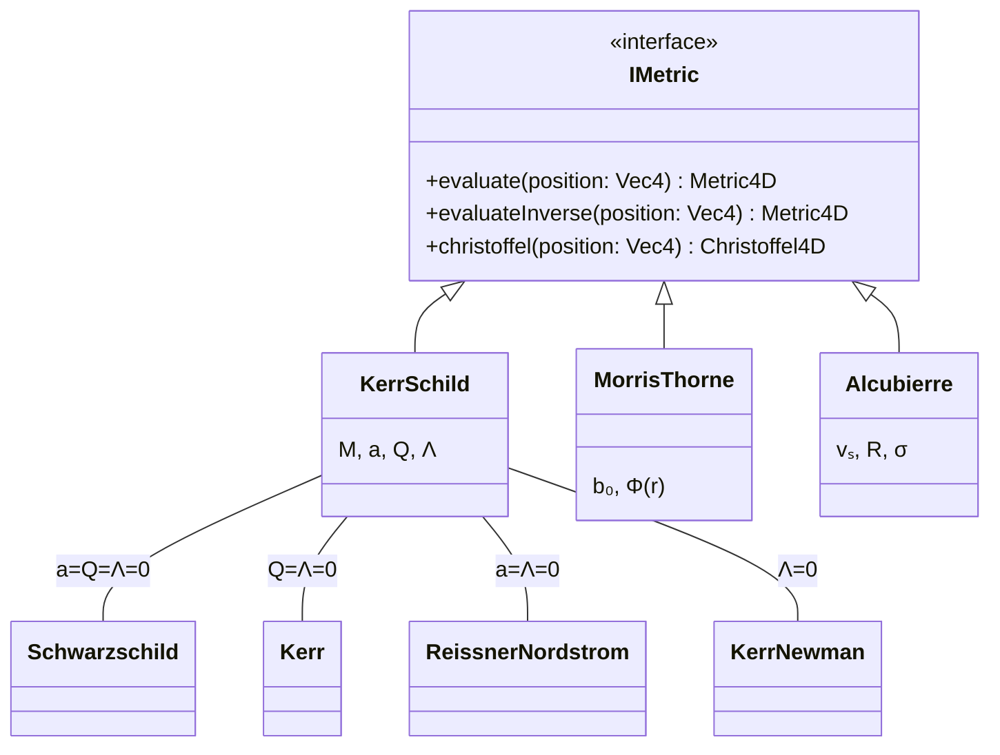
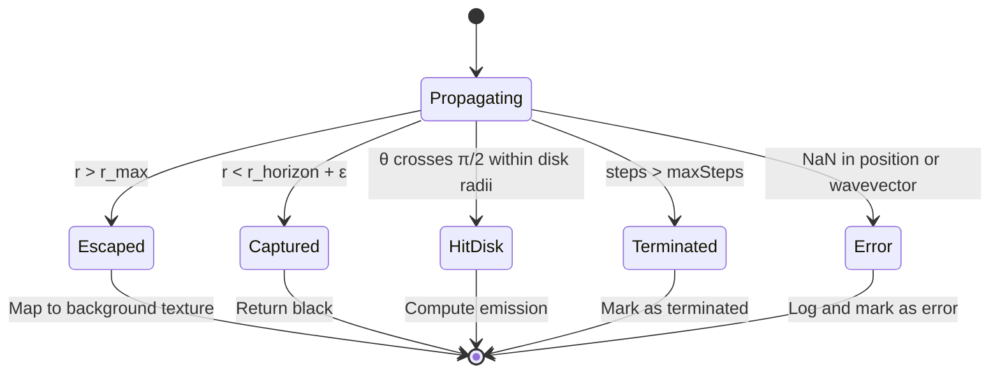
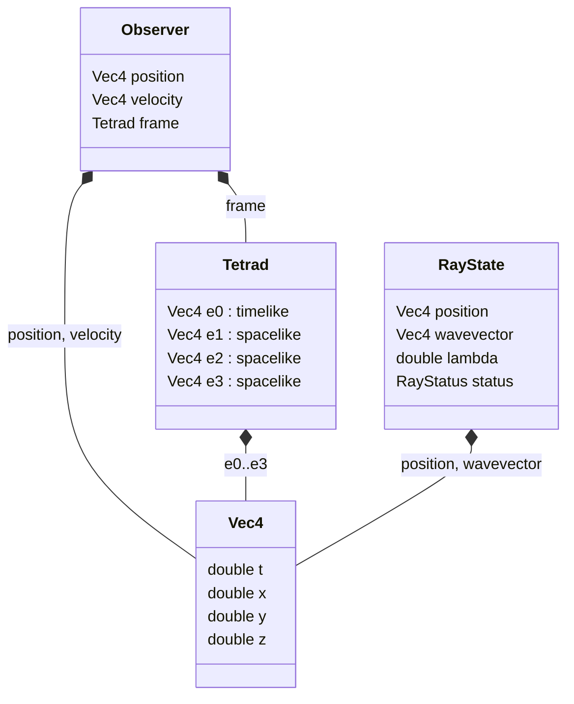

# Type System

## Overview

This document defines the types used in Sirius: numeric primitives, coordinate representations, tensor structures, ray state, and the metric interface. The type system serves two purposes. First, it encodes physical meaning; a `Vec4` in Boyer-Lindquist coordinates is not the same object as a `Vec4` in Cartesian coordinates, even though the storage is identical. Second, it enforces constraints; a metric tensor must be symmetric, a radial coordinate must be outside the horizon, the null condition must hold.

The document proceeds from primitive types through coordinate and tensor types to the domain-specific types (rays, observers, metrics) that compose the rendering pipeline.

---

## Part I: Design Principles

### 1.1 Value, Identity, and State

Three concepts organise the type system:

- **Value**: a datum that stands on its own. A metric tensor component, a coordinate, a step size. Values are compared by content.
- **Identity**: an entity that persists across time. A ray has identity; its position and wavevector are values that change as the ray propagates.
- **State**: the collection of values that describe an identity at a given time. State must be explicit; hidden state undermines debugging and reproducibility.

### 1.2 Invariants and Boundaries

An **invariant** is a condition that must remain true for a type to be valid. Examples:

- A radial coordinate $r > r_{horizon}$.
- A polar angle $\theta \in (0, \pi)$.
- The null condition $g_{\mu\nu} k^\mu k^\nu = 0$.

Sirius enforces invariants at **boundaries**, the entry points to a module or function. Inside a validated boundary, code assumes validity and operates without redundant checks. This keeps hot paths efficient while making the validation explicit and auditable.

### 1.3 Types Carry Physical Meaning

In a scientific renderer, types encode more than storage layout. A `Vec4` implies a coordinate system, a unit convention, and a set of valid operations. Using a Boyer-Lindquist position where a Cartesian position is expected produces wrong results silently. The type system does not currently enforce coordinate system distinctions at compile time (the coordinate system is tracked by convention), but the invariant documentation makes the requirement explicit.

---

## Part II: Primitive Types

### 2.1 Numeric Types

| Type | Usage | Rationale |
|------|-------|-----------|
| `float` | GPU computation, real-time rendering | Performance; ~7 decimal digits |
| `double` | CPU computation, high-precision integration | Accuracy; ~15 decimal digits |
| `int` | Indices, loop counters, discrete quantities | Exact integer arithmetic |
| `size_t` | Array sizes, memory allocation | Platform-sized unsigned integer |

### 2.2 Precision Trade-offs

The GPU uses single precision (`float`) for throughput. The CPU integration pipeline uses double precision (`double`) for accuracy. The boundary between GPU and CPU code handles precision conversion explicitly, with no implicit narrowing.

| Context | Precision | Tolerance |
|---------|-----------|-----------|
| GPU ray tracing | Single | $10^{-5}$ relative |
| CPU geodesic integration | Double | $10^{-12}$ relative |
| Conservation law monitoring | Double | $10^{-4}$ relative |

The tolerance column indicates the maximum acceptable error for computations in each context. GPU tolerances are looser because single-precision arithmetic accumulates error faster across hundreds of integration steps.

### 2.3 Boolean

Boolean values represent predicates and termination conditions:

```cpp
bool isTerminated = ray.status != RayStatus::Propagating;
bool isNullPreserved = std::abs(nullNorm) < tolerance;
```

---

## Part III: Coordinate Types

### 3.1 Coordinate Systems

Sirius uses multiple coordinate systems. The choice of coordinates affects numerical stability (Boyer-Lindquist has pole singularities; Cartesian Kerr-Schild does not) and the form of the metric (Boyer-Lindquist separates the Kerr geodesic equation; Cartesian coordinates do not).

| Coordinate System | Notation | Domain |
|-------------------|----------|--------|
| Boyer-Lindquist | $(t, r, \theta, \phi)$ | $r > r_+$, $\theta \in (0, \pi)$ |
| Cartesian (Kerr-Schild) | $(t, x, y, z)$ | All $\mathbb{R}^3$ except the ring singularity |
| Spherical (numerical) | $(t, r, \theta, \phi)$ | Grid bounds |

### 3.2 Vec4

The fundamental 4-vector type represents spacetime positions and wavevectors:

```cpp
struct Vec4 {
    double t, x, y, z;  // or t, r, theta, phi depending on coordinate system
};
```

**Invariant**: The coordinate system is tracked externally (by the metric implementation that produced the vector). A `Vec4` does not self-identify its coordinate system.

### 3.3 Coordinate Transformations

Transformations between coordinate systems are explicit function calls. The spin parameter $a$ is required because the Kerr-Schild to Boyer-Lindquist transformation depends on it.



---

## Part IV: Tensor Types

### 4.1 Metric Tensor

The metric tensor $g_{\mu\nu}$ is stored as a symmetric $4 \times 4$ matrix:

```cpp
using Metric4D = std::array<std::array<double, 4>, 4>;
```

**Invariants**:

- Symmetry: $g_{\mu\nu} = g_{\nu\mu}$
- Lorentzian signature: exactly one negative eigenvalue
- Invertibility: $\det(g) \neq 0$

### 4.2 Inverse Metric

The inverse metric $g^{\mu\nu}$ satisfies $g^{\mu\alpha}g_{\alpha\nu} = \delta^\mu_\nu$:

```cpp
Metric4D invertMetric(const Metric4D& g);
```

### 4.3 Christoffel Symbols

The Christoffel symbols $\Gamma^\lambda_{\mu\nu}$ form a 3-index array with symmetry in the lower indices:

```cpp
using Christoffel4D = std::array<std::array<std::array<double, 4>, 4>, 4>;
// christoffel[lambda][mu][nu] = Gamma^lambda_{mu nu}
```

**Invariant**: $\Gamma^\lambda_{\mu\nu} = \Gamma^\lambda_{\nu\mu}$ (lower-index symmetry, a consequence of the torsion-free connection).

---

## Part V: Metric Interface

### 5.1 IMetric Interface

All spacetime metrics implement a common interface, allowing the renderer to work with any geometry without coupling to a specific implementation. The interface is deliberately minimal: three methods that take a position and return the metric components, inverse, and Christoffel symbols. Geodesic integration, radiative transfer, and rendering are all built on top of these three operations.



### 5.2 Metric Families

Metrics are organised into parameterised families. Varying the parameters within a family interpolates between physically distinct spacetimes:

| Family | Parameters | Members |
|--------|------------|---------|
| Kerr-Schild | $(M, a, Q, \Lambda)$ | Schwarzschild, Kerr, Reissner-Nordstrom, Kerr-Newman, de Sitter |
| Morris-Thorne | $(b_0, \Phi)$ | Ellis drainhole, general wormholes |
| Warp Drive | $(v_s, R, \sigma)$ | Alcubierre, variants |

### 5.3 Parameter Bounds

Each metric family defines valid parameter ranges. These are physical constraints (a black hole with $|a| > M$ has no horizon) combined with practical limits (extreme parameters cause numerical difficulties):

| Parameter | Range | Constraint |
|-----------|-------|------------|
| Mass $M$ | $[0.1, 100]$ | Practical rendering scale |
| Spin $a/M$ | $[0, 0.998]$ | Sub-extremal; numerical stability near extremality |
| Charge $Q/M$ | $[0, 0.999]$ | Sub-extremal |
| Throat $b_0$ | $> 0$ | Physical wormhole requires positive throat radius |

---

## Part VI: Ray Types

### 6.1 Ray State

A ray is characterised by its position, wavevector, and integration state:

```cpp
struct RayState {
    Vec4 position;      // Spacetime coordinates
    Vec4 wavevector;    // Null tangent vector k^mu
    double lambda;      // Affine parameter (integration progress)
    RayStatus status;   // Current state of the ray
};
```

### 6.2 Ray Status and Termination

A ray begins in the `Propagating` state and transitions to a terminal state when one of the termination conditions is met. Every ray ends in exactly one terminal state.



---

## Part VII: Dual Number Types

### 7.1 Dual Number Template

```cpp
template<typename T>
struct Dual {
    T real;
    T dual;

    // Arithmetic operations preserving epsilon^2 = 0
};
```

### 7.2 Derivative Computation

Seeding a dual number input with a unit dual part extracts the corresponding partial derivative:

```cpp
Dual<double> x(r, 1.0);  // dx/dr = 1 (seed the r-direction)
auto result = f(x);       // result.dual = df/dr
```

### 7.3 Metric Derivatives

The Christoffel formula requires the partial derivatives $\partial_\mu g_{\nu\rho}$. Sirius evaluates the metric with dual number coordinates seeded in each coordinate direction. Four evaluations (one per coordinate) yield all 40 independent derivatives needed for the Christoffel symbols.

---

## Part VIII: Observer Types

The observer and ray types compose from the same primitives. The following diagram shows the composition relationships:



### 8.1 Observer State

An observer has a position on a worldline, a 4-velocity (timelike, unit-normalised), and a local orthonormal frame (tetrad).

### 8.2 Tetrad

A **tetrad** is an orthonormal frame adapted to the observer, a local coordinate system in which special relativity holds. It consists of four basis vectors: one timelike (parallel to the observer's 4-velocity) and three spacelike.

**Invariants**:

- Orthonormality: $g_{\mu\nu} e_a^\mu e_b^\nu = \eta_{ab}$ (the Minkowski metric in the tetrad frame)
- $e_0$ is future-directed timelike

The tetrad defines how the observer perceives directions. Incoming photon wavevectors are projected onto the tetrad to determine which pixel they correspond to.

---

## Part IX: Result and Error Types

### 9.1 Failure Representation

Operations that can fail return explicit result types rather than signalling failure through out-of-band mechanisms (exceptions in hot paths, sentinel values):

```cpp
std::optional<Metric4D> tryEvaluateMetric(const Vec4& position);
```

### 9.2 Error Conditions

| Error | Cause | Detection |
|-------|-------|-----------|
| OutOfDomain | Position outside valid coordinate region | Coordinate bounds check |
| SingularMetric | Metric determinant near zero | $\|\det(g)\| < \epsilon$ |
| NaNProduced | Invalid arithmetic operation | `isnan()` check |
| ConvergenceFailed | Iterative method did not converge | Iteration counter exceeds limit |

---

## Part X: Type Rules

| Rule | Level | Statement |
|------|-------|-----------|
| Precision selection | MUST | GPU uses `float`; CPU integration uses `double` |
| Boundary validation | MUST | Coordinates validated at metric entry points |
| Invariant preservation | MUST | Null constraint enforced throughout integration |
| Coordinate explicitness | SHOULD | Coordinate system documented and tracked with values |
| Failure expression | MUST | Failures return `optional` or set status; silent failure is forbidden |
| Immutable values | SHOULD | Metric evaluations return new objects rather than mutating state |

---

## Appendix A: Type Naming Conventions

| Name | Meaning |
|------|---------|
| `Vec4` | 4-component vector (spacetime position or wavevector) |
| `Metric4D` | $4 \times 4$ symmetric tensor (metric components) |
| `Christoffel4D` | $4 \times 4 \times 4$ connection coefficient array |
| `Dual<T>` | Dual number with real type `T` |
| `IMetric` | Abstract metric interface |

## Appendix B: Checklist

Before adding or modifying a type:

- [ ] The name expresses what the type represents and in which coordinate system.
- [ ] Invariants are enforced at the boundary (entry to the module or function).
- [ ] Precision is appropriate for the context (GPU vs CPU).
- [ ] The coordinate system is documented.
- [ ] Failure modes are encoded in the return type or status field.
